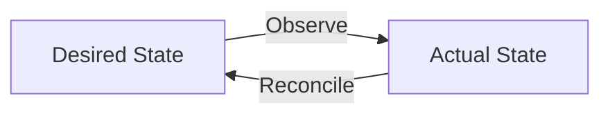

# Kubernetes Operators

_Making on-prem infrastructure feel Cloud-Native with the Java Operator SDK_

**Valentin Delaye**
<Email v="valentin.delaye@elca.ch" color="white" />

---
layout: side-title
side: l
color: slate-light
titlewidth: is-3
align: rm-lm
title: whoami
hideInToc: true
---

:: title ::

<p class="text-right">
  
</p>

<p class="text-sm text-opacity-70">
  <mdi-github /> jonesbusy<br>
  <mdi-linkedin /> valentin.delaye<br>
</p>

:: content ::

- <MdiBadgeAccountOutline /> `Valentin Delaye`
- <SimpleIconsBackstage /> `Platform Engineer at ELCA`
- <SimpleIconsJenkins /> `Jenkins maintainer and Governance Board`
- <OrasLogo /> `Java SDK maintainer`
- <GsocLogo /> `Google Summer of Code Mentor (2024 & 2025)`

---
layout: image-right
color: slate-light
image: images/agenda.png
class: text
---

# Agenda

- `What` vs `How` and `Developer Experience`
- `K8S Operators`
- `Java Operator SDK` and it's `Quarkus` extension
- A `GitOps` and (`BackstageOps`) approach via `FluxCD`
- Examples with K8S internal and external resources
- Q&A

---
layout: top-title-two-cols
color: slate-light
columns: is-6
align: l-lt-lt
---

<AdmonitionType type='tip' >
Developers only define intent in manifests. Platform handles the rest.
</AdmonitionType>

:: title ::

# `What` vs `How` (1)

:: left ::

- I need to connect my app to a database
- I need persistent storage for my service
- I need my app to be highly available

:: right ::

- I need to know how to deploy a database
- I need to know which storage class to use and how to provision it
- I need to know how many replicas to choose, cluster topology, etc.

---
layout: top-title-two-cols
color: slate-light
columns: is-6
align: l-lt-lt
---


:: title ::

# `What` vs `How` (2)

:: left ::

<<< @/snippets/cr/helm-release-dev.yaml

<AdmonitionType type='warning' >
Different values for different environments (dev/prod)<br />More abstraction needed
</AdmonitionType>

:: right ::

<<< @/snippets/cr/helm-release-prod.yaml

---
layout: top-title-two-cols
color: slate-light
columns: is-6
align: l-lt-lt
---

<strong>A Kubernetes Operator could</strong>

- Deploy a Database on K8S or provision a new schema on an external cluster (external resource)
- Drop a `ConfigMap` and `Secret` with required connection info
- Set the correct number of replicas, affinity rules, monitoring, etc.
- etc.

:: title ::

# `What` vs `How` (3)

:: left ::

<<< @/snippets/cr/cr-app-dev.yaml

:: right ::

<<< @/snippets/cr/cr-app-prod.yaml
---
layout: image-left
color: slate-light
image: images/roller-coaster-loop.png
class: text
---

# Kubernetes reconcile loop

<br />



---
layout: top-title-two-cols
color: slate-light
columns: is-6
align: l-lt-lt
---

:: title ::

# Dependent resource

:: left ::

- A `Deployment` managing `ReplicaSet` which in turn manages `Pods` (High level vs low level resource)
- High level abstractions or workflows
- `owner` references and garbage collection (across same namespace only)
- `Helm` is some kind of abstraction too! (On client side, no permanent reconciliation, no drift detection, etc.)
- `Flux CD` resource `HelmRelease` fix some of the issues with `Helm` (server side reconciliation, drift detection, etc.)

:: right ::


---
layout: top-title-two-cols
color: slate-light
columns: is-6
align: l-lt-lt
---

:: title ::

# A custom resource

:: left ::

<<< @/snippets/java/TodoApp.java

<AdmonitionType type='note' >
Fabric8 CRDGenerator to the rescue!
</AdmonitionType>

:: right ::

<<< @/snippets/crds/todoapps.samples.elca.ch-v1.yml

---
layout: top-title
color: slate-light
---

:: title ::

# Dependent resource (1)

:: content ::

<<< @/snippets/java/DatabaseResource.java {*}{lines:true,class:'!children:text-xs'}

<AdmonitionType type='warning' >
<ul>
  <li>Equality if not using records</li>
</ul>
</AdmonitionType>

---
layout: top-title
color: slate-light
---

:: title ::

# Dependent resource (2)

:: content ::

<<< @/snippets/java/ExternalDatabaseDependent.java {*}{lines:true,class:'!children:text-xs'}

---
layout: top-title
color: slate-light
---

:: title ::

# Dependent resource (3)

:: content ::

<<< @/snippets/java/KubernetesDatabaseDependent.java {*}{lines:true,class:'!children:text-xs'}

---
layout: top-title
color: slate-light
---

:: title ::

# Dependent resource (4)

:: content ::

<<< @/snippets/java/TodoAppReconciler.java {*}{lines:true,class:'!children:text-xs'}

---
layout: top-title
color: slate-light
--- 

:: title ::

# What we learned (1)

:: content ::

- Use `conditions` in `status` to reflect the progress of reconciliation (even for simple resources)

```yaml
status:
  conditions:
  - lastTransitionTime: "2025-10-07T11:49:44.177461113Z"
    message: Deployed TodoApp
    observedGeneration: 1
    status: "True"
    type: Done
  - status: "False"
    type: Started
  - status: "False"
    type: HasErrors
  deployedAppVersion: 0.0.11
  deployedVersion: 0.16.1
  lastHandledReconcileAt: "2025-10-07T11:49:44.192938122Z"
  location: my-todo-app.apps.my-domain.elca.ch
  observedGeneration: 1
```

---
layout: top-title
color: slate-light
--- 

:: title ::

# What we learned (2)

:: content ::

- Monitor closely external resource polling intervals (equality, outbound HTTP requests, etc.)


- Controller logs are not very useful for end-users, use events


---
layout: top-title
color: slate-light
--- 

:: title ::

# What we learned (3)

:: content ::

- Test your controllers!


- Additional columns are useful to give instant feedback to consumers

```
kubectl get todoapps.samples.elca.ch

NAME          STATUS             DONE   APP VERSION   VERSION   LOCATION
my-todo-app   Deployed TodoApp   True   0.0.11        0.16.1    my-todo-app.apps.my-domain.elca.ch

```

---
layout: top-title
color: slate-light
--- 

:: title ::

# Challenges we faced

:: content ::

## Technical

- Learning curve
- Many best practices to follow to implement a good operator
- Expertise in Kubernetes internals
- Migrate existing workflows/automation to custom resources

## Non-technical

- Culture change and mindset for (Dev vs Ops)
- Non-cloud-native apps and legacy systems
- Wire into existing infrastructure and processes

---
layout: top-title
color: slate-light
--- 

:: title ::

# Current state

:: content ::

- ~ `7500` CR managed (and growing!)
- ~ `15` minutes to check all CRs state with max 5 reconciliations in parallel (restart)
- ~ Less that `half second` start time with Quarkus native image
- ~ `512 MB` memory for the operator


---
layout: image-right
color: slate-light
image: images/question.jpg
class: text
---

# Thank you!

<p class="text-sm text-opacity-70">
  <mdi-email />valentin.delaye@elca.ch <br>
  <mdi-linkedin /><a href="https://www.linkedin.com/in/valentin.delaye" class="ns-c-iconlink">valentin.delaye</a><br>
  <mdi-github /><a href="https://github.com/jonesbusy" class="ns-c-iconlink">jonesbusy</a><br>
</p>

# References

- [Java Operator SDK Documentation](https://javaoperatorsdk.io/docs/)
- [API conditions and conventions](https://github.com/kubernetes/community/blob/master/contributors/devel/sig-architecture/api-conventions.md#spec-and-status)
- [🚀 KRM-Native GitOps: Yes — Without Flux, No. (FluxCD or Nothing.)](https://www.linkedin.com/pulse/krm-native-gitops-yes-without-flux-fluxcd-nothing-mialon-wsmue/)
